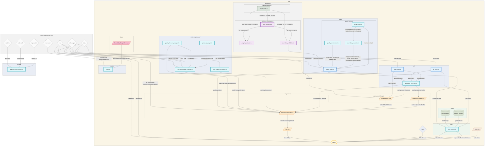

```mermaid
flowchart TD

%% Subgraphs ----------
subgraph external_deps["external dependencies"]
vue{"vue"}
pinia{"pinia"}
cytoscape{"cytoscape"}
vue_router{"vue-router"}
node_fs{"node:fs"}
node_path{"node:path"}
typescript{"typescript"}
end

subgraph src_dir["src/"]
src_main_ts(["main.ts"])
src_App_vue[/App.vue/]
src_router{"router"}
src_assets_main_css[/main.css/]

subgraph views_dir["views/"]
src_views_KnowledgeGraphView_vue[/KnowledgeGraphView.vue/]
end

subgraph components_dir["components/"]
src_components_KnowledgeGraph_vue[/KnowledgeGraph.vue/]

subgraph components_graph_dir["components/graph/"]
src_components_graph_NodeWindow_vue[/NodeWindow.vue/]
src_components_graph_OperationToolbar_vue[/OperationToolbar.vue/]
end
end

subgraph graph_dir["graph/"]
src_graph_graph_store_ts["graph_store.ts"]

subgraph graph_utilities_dir["graph/utilities/"]
src_graph_utilities_graph_persistence_ts["graph_persistence.ts"]
src_graph_utilities_operation_executor_ts["operation_executor.ts"]
src_graph_utilities_graph_utils_ts["graph_utils.ts"]
end
end

subgraph render_dir["render/cytoscape/"]
src_render_cytoscape_graph_element_mapper_ts["graph_element_mapper.ts"]
src_render_cytoscape_use_cytoscape_renderer_ts["use_cytoscape_renderer.ts"]
src_render_cytoscape_use_graph_interaction_ts["use_graph_interaction.ts"]
src_render_cytoscape_cytoscape_style_ts["cytoscape_style.ts"]
end

subgraph ui_dir["ui/"]
src_ui_draft_store_ts["draft_store.ts"]
src_ui_operation_controller_ts["operation_controller.ts"]
src_ui_ui_store_ts["ui_store.ts"]
end

subgraph definitions_dir["definitions/"]
subgraph definitions_rules_dir["definitions/rules/"]
src_definitions_rules_graph_rules_ts["graph_rules.ts"]
end

subgraph definitions_validators_dir["definitions/validators/"]
src_definitions_validators_graph_validator_ts["graph_validator.ts"]
src_definitions_validators_operation_validator_ts["operation_validator.ts"]
src_definitions_validators_rule_checkers_ts["rule_checkers.ts"]
end
end

subgraph dev_dir["dev/"]
src_dev_test_runtime_ts["test_runtime.ts"]
end

subgraph mock_dir["mock/"]
src_mock_golden_graph_ts[("golden_graph.ts")]
src_mock_mockGraph_ts[("mockGraph.ts")]
end

subgraph router_dir["router/"]
src_router_index_ts["index.ts"]
end
end

subgraph scripts_dir["scripts/"]
scripts_dependency_scanner_ts["dependency_scanner.ts"]
end

%% Dependency ----------
src_components_KnowledgeGraph_vue -->|"default:KnowledgeGraph"| src_App_vue
vue -->|"ref, onMounted, onBeforeUnmount, watch"| src_components_KnowledgeGraph_vue
src_graph_graph_store_ts -->|"useGraphStore"| src_components_KnowledgeGraph_vue
src_render_cytoscape_graph_element_mapper_ts -->|"mapGraphDataToCyElements"| src_components_KnowledgeGraph_vue
src_render_cytoscape_use_cytoscape_renderer_ts -->|"useCytoscapeRenderer"| src_components_KnowledgeGraph_vue
src_render_cytoscape_use_graph_interaction_ts -->|"useGraphInteraction"| src_components_KnowledgeGraph_vue
src_ui_operation_controller_ts -->|"useOperationController"| src_components_KnowledgeGraph_vue
src_components_graph_NodeWindow_vue -->|"default:NodeWindow"| src_components_KnowledgeGraph_vue
src_components_graph_OperationToolbar_vue -->|"default:OperationToolbar"| src_components_KnowledgeGraph_vue

vue -->|"computed"| src_components_graph_NodeWindow_vue
src_ui_draft_store_ts -->|"useDraftStore"| src_components_graph_NodeWindow_vue
src_ui_operation_controller_ts -->|"useOperationController"| src_components_graph_NodeWindow_vue
src_ui_operation_controller_ts -->|"useOperationController"| src_components_graph_OperationToolbar_vue

src_definitions_validators_rule_checkers_ts -->|"* as RuleCheckers"| src_definitions_validators_graph_validator_ts
src_definitions_rules_graph_rules_ts -->|"DEFAULT_GRAPH_RULES"| src_definitions_validators_graph_validator_ts
src_definitions_rules_graph_rules_ts -->|"DEFAULT_GRAPH_RULES"| src_definitions_validators_operation_validator_ts
src_definitions_validators_rule_checkers_ts -->|"* as RuleCheckers"| src_definitions_validators_operation_validator_ts
src_definitions_rules_graph_rules_ts -->|"DEFAULT_GRAPH_RULES"| src_definitions_validators_rule_checkers_ts

src_graph_graph_store_ts -->|"useGraphStore"| src_dev_test_runtime_ts
src_mock_mockGraph_ts -->|"mockGraph"| src_dev_test_runtime_ts
src_mock_golden_graph_ts -->|"goldenGraph"| src_dev_test_runtime_ts
src_ui_ui_store_ts -->|"useUIStore"| src_dev_test_runtime_ts

pinia -->|"defineStore"| src_graph_graph_store_ts
src_definitions_validators_operation_validator_ts -->|"OperationValidator"| src_graph_graph_store_ts
src_graph_utilities_graph_persistence_ts -->|"saveGraph, loadGraph, deleteGraph"| src_graph_graph_store_ts
src_graph_utilities_operation_executor_ts -->|"applyOperationToGraph, pushUndoSnapshot, shouldPushUndoSnapshot"| src_graph_graph_store_ts
src_graph_utilities_graph_utils_ts -->|"normalizeGraph"| src_graph_graph_store_ts
src_graph_utilities_graph_utils_ts -->|"cleanGraphAfterDeleteNode, collectDependencyNodeIds"| src_graph_utilities_operation_executor_ts

vue -->|"createApp"| src_main_ts
pinia -->|"createPinia"| src_main_ts
src_App_vue -->|"default:App"| src_main_ts
src_router -->|"default:router"| src_main_ts
src_dev_test_runtime_ts -->|"initTestRuntime"| src_main_ts
src_dev_test_runtime_ts -->|"exposeTestRuntimeToWindow"| src_main_ts
src_assets_main_css -->|"(side-effect)"| src_main_ts

cytoscape -->|"default:cytoscape"| src_render_cytoscape_use_cytoscape_renderer_ts
cytoscape -->|"Core"| src_render_cytoscape_use_cytoscape_renderer_ts
vue -->|"Ref"| src_render_cytoscape_use_cytoscape_renderer_ts
src_render_cytoscape_graph_element_mapper_ts -->|"CyElements"| src_render_cytoscape_use_cytoscape_renderer_ts
src_render_cytoscape_cytoscape_style_ts -->|"createCytoscapeStyle"| src_render_cytoscape_use_cytoscape_renderer_ts
cytoscape -->|"Core, EventObject"| src_render_cytoscape_use_graph_interaction_ts

vue_router -->|"createRouter, createWebHistory"| src_router_index_ts
src_views_KnowledgeGraphView_vue -->|"default:KnowledgeGraphView"| src_router_index_ts

pinia -->|"defineStore"| src_ui_draft_store_ts
src_graph_graph_store_ts -->|"useGraphStore"| src_ui_operation_controller_ts
src_ui_ui_store_ts -->|"useUIStore"| src_ui_operation_controller_ts
src_ui_draft_store_ts -->|"useDraftStore"| src_ui_operation_controller_ts
pinia -->|"defineStore"| src_ui_ui_store_ts

node_fs -->|"default:fs"| scripts_dependency_scanner_ts
node_path -->|"default:path"| scripts_dependency_scanner_ts
typescript -->|"default:ts"| scripts_dependency_scanner_ts

%% Class ----------
class vue,pinia,cytoscape,vue_router,node_fs,node_path,typescript external_integration;
class src_router internal_integration;
class src_main_ts entry_point;
class src_App_vue,src_components_KnowledgeGraph_vue,src_components_graph_NodeWindow_vue,src_components_graph_OperationToolbar_vue component_file;
class src_views_KnowledgeGraphView_vue view_file;
class src_assets_main_css ui_asset;
class src_graph_graph_store_ts,src_ui_draft_store_ts,src_ui_ui_store_ts store_runtime;
class src_ui_operation_controller_ts,src_graph_utilities_graph_persistence_ts,src_graph_utilities_operation_executor_ts,src_graph_utilities_graph_utils_ts,src_render_cytoscape_graph_element_mapper_ts,src_render_cytoscape_use_cytoscape_renderer_ts,src_render_cytoscape_use_graph_interaction_ts,src_render_cytoscape_cytoscape_style_ts,src_dev_test_runtime_ts,scripts_dependency_scanner_ts execution_runtime;
class src_definitions_validators_graph_validator_ts,src_definitions_validators_operation_validator_ts,src_definitions_validators_rule_checkers_ts validation_runtime;
class src_definitions_rules_graph_rules_ts rule_definition;
class src_mock_golden_graph_ts,src_mock_mockGraph_ts temporary_data;
class src_router_index_ts execution_runtime;

%% Style ----------
style external_deps fill:#F2F2F2,stroke:#999,stroke-width:1px;
style src_dir fill:#FAF5E6,stroke:#999,stroke-width:1px;
style graph_dir fill:#E9EDF5,stroke:#999,stroke-width:1px;
style graph_utilities_dir fill:#E9EDF5,stroke:#999,stroke-width:1px;
style ui_dir fill:#E9EDF5,stroke:#999,stroke-width:1px;
style render_dir fill:#E9EDF5,stroke:#999,stroke-width:1px;
style definitions_dir fill:#F2F2F2,stroke:#999,stroke-width:1px;
style definitions_rules_dir fill:#F2F2F2,stroke:#999,stroke-width:1px;
style definitions_validators_dir fill:#F2F2F2,stroke:#999,stroke-width:1px;
style components_dir fill:#FAF5E6,stroke:#999,stroke-width:1px;
style components_graph_dir fill:#FAF5E6,stroke:#999,stroke-width:1px;
style views_dir fill:#FAF5E6,stroke:#999,stroke-width:1px;
style dev_dir fill:#EDF5ED,stroke:#999,stroke-width:1px;
style mock_dir fill:#EDF5ED,stroke:#999,stroke-width:1px;
style router_dir fill:#E9EDF5,stroke:#999,stroke-width:1px;
style scripts_dir fill:#E9EDF5,stroke:#999,stroke-width:1px;

%% ==========================================
%% classDef 全局共享样式模板
%% ==========================================
classDef type_definition fill:#DADDE2,stroke:#555,stroke-width:1px;
classDef rule_definition fill:#DCE5DD,stroke:#4f6f52,stroke-width:1px;

classDef store_runtime fill:#e3f2fd,stroke:#1976d2,stroke-width:2px;
classDef validation_runtime fill:#f3e5f5,stroke:#7b1fa2,stroke-width:2px;
classDef execution_runtime fill:#e0f7fa,stroke:#0097a7,stroke-width:2px;

classDef temporary_data fill:#DDE6D5,stroke:#6f7f68,stroke-width:1px;
classDef runtime_data fill:#c4dfc5,stroke:#2e7d32,stroke-width:1px;
classDef persisted_data fill:#81c784,stroke:#2e7d32,stroke-width:1px;

classDef view_file fill:#fabbd0,stroke:#c62828,stroke-width:1px;
classDef component_file fill:#fdeacb,stroke:#ef6c00,stroke-width:1px;
classDef ui_asset fill:#F6E8DD,stroke:#a66a3f,stroke-width:1px;

classDef entry_point fill:#fff8e1,stroke:#fbc02d,stroke-width:2px;
classDef exit_point fill:#f5c6cb,stroke:#b71c1c,stroke-width:2px;

classDef external_integration fill:#fafafa,stroke:#333,stroke-dasharray:5 5;
classDef internal_integration fill:#E9EDF5,stroke:#333,stroke-dasharray:5 5;

linkStyle default stroke:#666,stroke-width:1px;

```